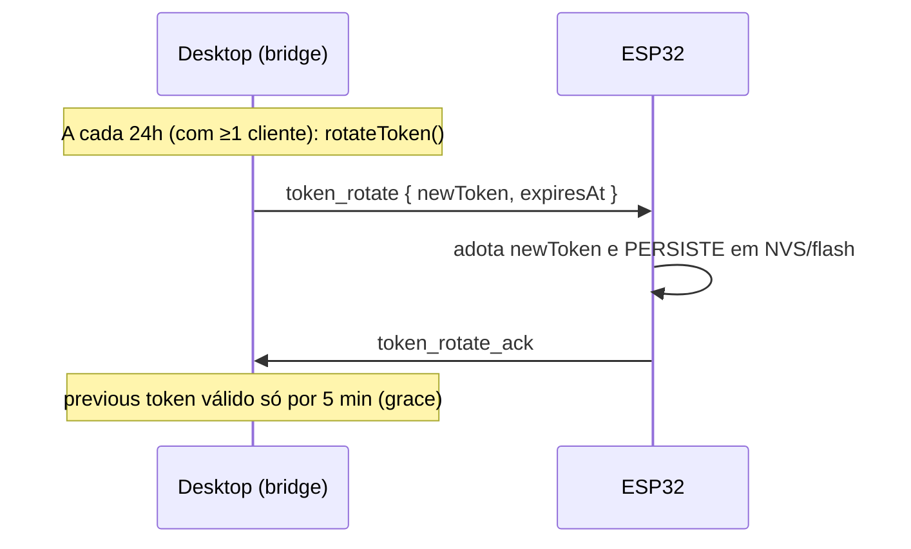

# Documento 1 — Protocolo do PWA do Clawd-on-Desk (v1)

> Análise de engenharia reversa do protocolo usado pelo PWA móvel do
> [clawd-on-desk](https://github.com/rullerzhou-afk/clawd-on-desk), com foco no
> que o firmware do ESP32 precisa implementar para atuar como **cliente de
> exibição** (display client).

Fontes primárias no repositório de origem:

- `src/network/mobile-preview-server.js` — o servidor (bridge WebSocket LAN).
- `pwa/app.js` — o cliente PWA de referência.
- `docs/mobile-protocol-v1.md` — especificação oficial "Mobile Protocol v1".
- `src/state-priority.js` — agregação de estados (qual animação o "pet" mostra).
- `docs/guides/state-mapping.md` + `themes/clawd/theme.json` — mapeamento
  evento → estado → animação.

---

## 1. Visão geral

O PWA **não é** o renderizador das animações do Claude. Ele é um **painel de
monitoramento read-only**: mostra cartões de sessão com um "badge" de estado e
ícones SVG. As animações do mascote (o caranguejo **Clawd**) são renderizadas
pelo **app desktop (Electron)**, que resolve `state → arquivo de animação`.

O ponto central para o projeto ESP32:

> O desktop expõe uma **bridge WebSocket na LAN**. Qualquer cliente na mesma
> rede (o PWA, ou o ESP32) recebe os **estados das sessões** e pode decidir o
> que exibir. O ESP32 será **mais um cliente desse mesmo protocolo**, porém em
> vez de desenhar cartões, ele reproduz a **animação do mascote** correspondente
> ao estado dominante — replicando o que o "pet" do desktop faz.

```text
Claude Code / Codex / etc.  (hooks)
        │  eventos de ciclo de vida
        ▼
  Clawd Desktop — State engine  (Map<sessionId, session>)
        │  poll a cada 2 s
        ▼
  LAN WebSocket bridge  (0.0.0.0:<porta>)
        ├── HTTP  → serve o PWA em /mobile/*
        └── WS    → /ws?token=<hex>
                     │  snapshot / state / session_deleted / token_rotate
                     ├──────────────► PWA (painel de sessões)
                     └──────────────► ESP32 (animação do mascote)  ← NOVO
```

---

## 2. Transporte e handshake

| Item | Valor | Observação (impacto no firmware) |
|---|---|---|
| Protocolo | HTTP 1.1 + WebSocket (RFC 6455) | Use uma lib WS de cliente (ex.: `arduinoWebSockets`). |
| Bind | `0.0.0.0:<porta>` | Acessível na LAN. ESP32 precisa estar na mesma rede Wi-Fi. |
| Porta padrão | `23334` | O servidor tenta `23334..23338` se a porta estiver ocupada. **A porta não é fixa** — descubra-a ou permita configuração. |
| Caminho WS | `/ws` | — |
| Autenticação | query string `?token=<hex de 32 chars>` | Token obrigatório no *upgrade*. |
| TLS | **Nenhum** (ws\://, texto puro) | Somente LAN. Não implemente WSS. |
| Descoberta | `GET /api/connection-info` → `{ status, port, lanIp }` | **Não** retorna o token (por segurança). Útil para achar `port`/`lanIp`. |
| Estáticos PWA | `GET /mobile/*` | Irrelevante para o ESP32 (não vamos servir a UI web). |

### Token e ciclo de vida
- Token = 16 bytes aleatórios em hex (`/^[a-f0-9]{32,64}$/`), gerado uma vez e
  guardado em `~/.clawd/mobile-token.json` no host.
- O token **só** aparece na página de Settings do desktop (via QR / *pair URL*).
  O endpoint público de descoberta **não** o expõe.
- **Rotação automática a cada 24 h**, com **janela de tolerância de 5 min** para
  o token anterior (ver §5).

### Códigos de fechamento (WebSocket close codes)
| Código | Significado | Ação no ESP32 |
|---|---|---|
| `1008` | Token inválido / expirado / rate-limit / rotação não confirmada / token regenerado | Parar reconexão automática silenciosa; sinalizar "auth falhou" na tela. Reconectar só com novo token. |
| `1013` | Servidor ocupado (≥ 10 clientes) | Aguardar e tentar de novo com backoff. |
| `1001` | Servidor desligando | Reconectar com backoff. |
| `1000`/outros | Fechamento normal / rede | Reconectar com backoff exponencial. |

### Limites operacionais
- **Heartbeat:** o servidor envia **ping a cada 30 s** e **encerra** o cliente
  se não houver **pong em até 90 s** (`CLIENT_TIMEOUT_MS`). A maioria das libs
  WS responde ping→pong automaticamente, mas **confirme** isso no ESP32.
- **Rate limit:** 60 mensagens de entrada por 60 s por cliente (excedeu → close
  `1008`). O ESP32 quase não envia nada, então não é um problema.
- **Máx. de clientes:** 10 conexões simultâneas.
- **Latência:** o servidor faz *poll* do cache de sessões a cada **2 s** →
  consistência eventual. O ESP32 não consegue ser mais "rápido" que isso.

---

## 3. Envelope das mensagens

Todas as mensagens do servidor são **JSON** com um envelope comum:

```json
{ "version": "v1", "type": "<tipo>", "timestamp": 1717200000000, "...": "payload" }
```

| Campo | Tipo | Descrição |
|---|---|---|
| `version` | string | Sempre `"v1"`. |
| `type` | string | Tipo da mensagem (ver §4). |
| `timestamp` | number | Unix ms no host. |

---

## 4. Mensagens Servidor → Cliente

### 4.1 `snapshot` — estado completo (enviado ao conectar)
```json
{
  "version": "v1", "type": "snapshot", "timestamp": 1717200000000,
  "sessions": {
    "abc123": {
      "sessionId": "abc123",
      "agentId": "claude-code",
      "title": "Fix auth bug",
      "basename": "project",
      "state": "working",
      "updatedAt": 1717199990000,
      "recentEvents": [ { "event": "PreToolUse", "at": 1717199990000, "state": "working" } ]
    }
  }
}
```

### 4.2 `state` — atualização incremental de uma sessão
```json
{
  "version": "v1", "type": "state", "timestamp": 1717200001000,
  "sessionId": "abc123",
  "data": { "sessionId": "abc123", "state": "thinking", "title": "…", "basename": "…",
            "updatedAt": 1717200000500, "recentEvents": [ … ] }
}
```
Semântica: faça **merge** de `data` na sessão `sessionId` (crie se não existir).

### 4.3 `session_deleted` — sessão removida
```json
{ "version": "v1", "type": "session_deleted", "timestamp": 1717200002000, "sessionId": "abc123" }
```

### 4.4 `token_rotate` — novo token (rotação/tolerância)
```json
{ "version": "v1", "type": "token_rotate", "timestamp": 1717200003000,
  "newToken": "…64hex…", "expiresAt": 1717200303000 }
```
O cliente **deve** adotar `newToken` e responder `token_rotate_ack` (ver §5).

> **Nota — `tool_output`:** o `pwa/app.js` também trata uma mensagem
> `tool_output` (`{sessionId, data:{toolName, output}}`), mas o servidor v1 do
> `mobile-preview-server.js` **não a emite** (M1 é read-only e não sincroniza
> saída de ferramentas). O ESP32 **não precisa** implementá-la — apenas ignore
> tipos desconhecidos por robustez.

### 4.5 Payload de sessão (o que interessa ao ESP32)
| Campo | Tipo | Necessário no ESP32? |
|---|---|---|
| `sessionId` | string | **Sim** — chave do mapa local. |
| `state` | string | **Sim** — é o que dirige a animação. |
| `agentId` | string\|null | Opcional (ex.: ícone/label do agente). |
| `title` | string\|null | Opcional (texto na barra de status). |
| `basename` | string\|null | Opcional (nome do projeto). |
| `updatedAt` | number\|null | Opcional (desempate/ordenação). |
| `recentEvents` | array (≤10) `{event,at,state}` | **Não** — pode ser ignorado para economizar RAM. |

> **Privacidade (por design do M1):** o payload nunca traz caminho completo do
> `cwd`, entradas de ferramentas, prompts, nem transcrições — só o `basename` e
> nomes de evento. Isso simplifica o parse no ESP32.

---

## 5. Rotação de token — o detalhe crítico para o ESP32

O servidor rotaciona o token a cada 24 h. Fluxo:



Regras do servidor:
- Após rotacionar, ele marca cada cliente com `pendingRotationAcks` e **reenvia**
  `token_rotate` a cada heartbeat (30 s) até receber o ack, **até 3 vezes**;
  sem ack → `close 1008`.
- O token anterior continua aceito **apenas durante os 5 min de grace**. Quando
  o ESP32 reconecta na janela de grace com o token antigo, o servidor aceita e
  **imediatamente** envia um `token_rotate` com o token atual.

**Consequência para o firmware (não óbvia, mas essencial):**

> O ESP32 **precisa persistir o token rotacionado** (NVS/Preferences). Se ele
> reiniciar após uma rotação carregando apenas o token gravado em tempo de
> compilação/provisionamento, e passarem-se mais de 5 min, ele fica **bloqueado
> (1008)** e exige novo provisionamento manual. Persistir o `newToken` a cada
> `token_rotate` elimina esse risco.

Cliente → Servidor: **a única mensagem aceita é `token_rotate_ack`**
(`{ "type": "token_rotate_ack" }`). Qualquer outra é contada no rate-limit e
ignorada (M1 é read-only).

---

## 6. Estados e agregação (qual animação exibir)

### 6.1 Conjunto de estados
`idle`, `thinking`, `working`, `juggling`, `carrying`, `sweeping`,
`attention`, `notification`, `error`, `sleeping`.
(Internamente o desktop também usa `roam`, e uma sequência de sono
`yawning → dozing → collapsing → sleeping → waking`, mas via LAN o payload
transmite apenas o campo `state` já resolvido.)

### 6.2 Prioridade (de `src/state-priority.js`)
Quando há **várias sessões**, o mascote mostra o estado de **maior prioridade**:

| Estado | Prioridade |
|---|---|
| `error` | 8 |
| `notification` | 7 |
| `sweeping` | 6 |
| `attention` | 5 |
| `carrying` | 4 |
| `juggling` | 4 |
| `working` | 3 |
| `thinking` | 2 |
| `idle` / `roam` | 1 |
| `sleeping` | 0 |

Algoritmo (a portar para C++):
```
dominante = max_por_prioridade( state de todas as sessões recebidas )
se não há sessões            → "idle"
```
> O payload da LAN **não** inclui o campo `headless` (o desktop filtra sessões
> headless antes de publicar), então no ESP32 basta pegar o máximo sobre todas
> as sessões recebidas.

### 6.3 Mapa estado → animação (tema "clawd")
De `docs/guides/state-mapping.md` + `themes/clawd/theme.json` (`states`):

| Estado | Evento típico do agente | Animação (arquivo GIF de referência) |
|---|---|---|
| `idle` | Sem atividade | `clawd-idle.gif` |
| `thinking` | `UserPromptSubmit` | `clawd-thinking.gif` |
| `working` | `PreToolUse` / `PostToolUse` (1 sessão) | `clawd-typing.gif` |
| `working` (2 sessões) | tier | `clawd-headphones-groove.gif` |
| `working` (3+ sessões) | tier | `clawd-building.gif` |
| `juggling` | `SubagentStart` (1) | `clawd-headphones-groove.gif` |
| `juggling` (2+) | tier | `clawd-juggling.gif` |
| `error` | `PostToolUseFailure` | `clawd-error.gif` |
| `attention` | `Stop` / tarefa concluída | `clawd-happy.gif` |
| `notification` | `PermissionRequest` | `clawd-notification.gif` |
| `sweeping` | `PreCompact` | `clawd-sweeping.gif` |
| `carrying` | `WorktreeCreate` | `clawd-carrying.gif` |
| `sleeping` | 60 s ocioso | `clawd-sleeping.gif` |

> Os "tiers" por contagem de sessões (`working`/`juggling`) são um **opcional
> avançado**. O MVP pode usar 1 arquivo por estado. Para reproduzir tiers, o
> ESP32 precisa contar quantas sessões estão em `working`/`juggling` (dá para
> derivar do mapa local).

### 6.4 Debounce de estados "one-shot"
O desktop garante tempo mínimo de exibição para estados momentâneos
(`attention`, `notification`, etc. ~4 s) para que "piscadas" rápidas sejam
percebidas. É recomendável replicar isso no ESP32 (Fase 4): manter estados
one-shot (`attention`, `error`, `notification`, `sweeping`, `carrying`) por um
tempo mínimo antes de ceder a um estado de menor prioridade.

---

## 7. Resumo do que o firmware precisa implementar

1. **Wi-Fi STA** + provisionamento de `host`, `port`, `token`.
2. **Cliente WebSocket** para `ws://<host>:<port>/ws?token=<token>`.
3. **Ping/pong** garantido (responder ao ping do servidor dentro de 90 s).
4. **Parser JSON** dos tipos: `snapshot`, `state`, `session_deleted`,
   `token_rotate` (ignorar desconhecidos).
5. **Mapa local** `Map<sessionId, state>` alimentado por snapshot/state/delete.
6. **Agregador de estado dominante** (tabela `STATE_PRIORITY` da §6.2).
7. **Tabela estado → animação** (§6.3) + troca de animação na mudança de estado
   dominante, com debounce de one-shots.
8. **Rotação de token:** ao receber `token_rotate` → adotar, **persistir em
   NVS**, enviar `token_rotate_ack`.
9. **Reconexão** com backoff exponencial e tratamento dos close codes (§2).

O que **não** precisa: servir o PWA, UI de sessões/cartões, notificações do
navegador, service worker, engine de temas/SVG, acessórios, eye-tracking,
`tool_output`, nem qualquer operação de escrita/aprovação (o protocolo v1 é
read-only).
